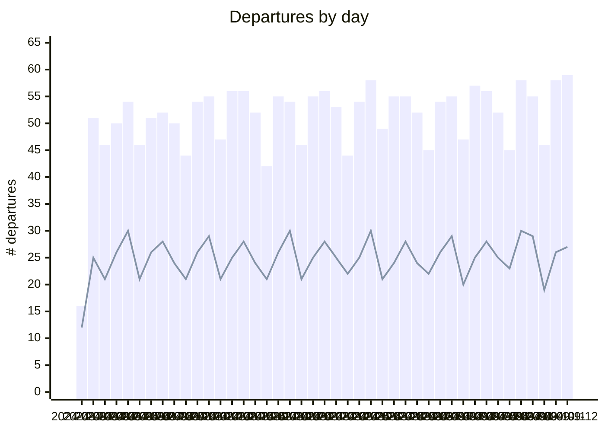

# tll-airport-departures

Tracking departures from Tallinn Airport. Data and graphs are updated daily.

I created this repo to:
- Test how to use Mermaid charting functions for basic reporting
- Test how to use Github Actions for scheudling basic data pipelines and transformations
- Find out where we can fly to from Tallinn

## Trend of Daily Departures

Bars for total number of departures. Line for unique destinations.




## Unique destinations and departures

All destinations flown to from Tallinn. More departures = bigger node.
Note that umlauts don't seem to be supported in Mermaid Sankey Diagrams (experimental diagram).

```mermaid
---
config:
  sankey:
    showValues: false
    width: 800
    height: 1000
---
sankey-beta
%% source,target,value
Tallinn,Amsterdam,42
Tallinn,Antalya,70
Tallinn,Ateena,8
Tallinn,Barcelona,13
Tallinn,Berliin,48
Tallinn,Billund,24
Tallinn,Bodrum,1
Tallinn,Brussel,24
Tallinn,Burgas,18
Tallinn,Catania,1
Tallinn,Dublin,12
Tallinn,Dubrovnik,12
Tallinn,Frankfurt,116
Tallinn,Goteborg,1
Tallinn,Helsingi,407
Tallinn,Heraklion,24
Tallinn,Istanbul,40
Tallinn,Kerkira,4
Tallinn,Kopenhaagen,47
Tallinn,Košice,1
Tallinn,Kuressaare,73
Tallinn,Kardla,73
Tallinn,Lamezia,1
Tallinn,London,82
Tallinn,Malaga,18
Tallinn,Malta,6
Tallinn,Milano,49
Tallinn,Munchen,61
Tallinn,Nice,12
Tallinn,Oslo,48
Tallinn,Palma De Mallorca,7
Tallinn,Paphos,12
Tallinn,Pariis,42
Tallinn,Praha,24
Tallinn,Rhodos,13
Tallinn,Riia,169
Tallinn,Rooma,18
Tallinn,Split,12
Tallinn,Stockholm,280
Tallinn,Tampere,7
Tallinn,Tirana,6
Tallinn,Tivat,18
Tallinn,Varssavi,137
Tallinn,Veneetsia-Treviso,12
Tallinn,Viin,19
Tallinn,Vilnius,49
Tallinn,Zurich,34


```
