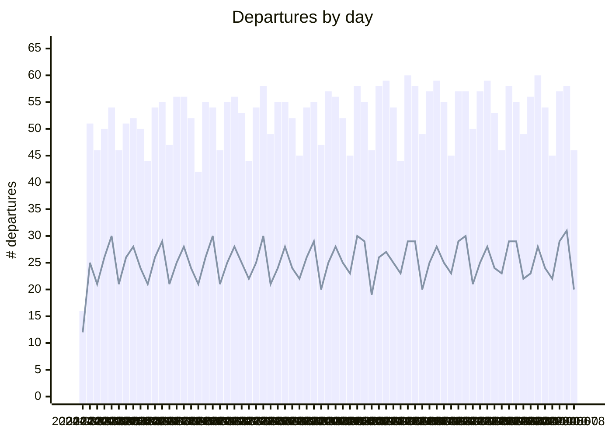

# tll-airport-departures

Tracking departures from Tallinn Airport. Data and graphs are updated daily.

I created this repo to:
- Test how to use Mermaid charting functions for basic reporting
- Test how to use Github Actions for scheudling basic data pipelines and transformations
- Find out where we can fly to from Tallinn

## Trend of Daily Departures

Bars for total number of departures. Line for unique destinations.




## Unique destinations and departures

All destinations flown to from Tallinn. More departures = bigger node.
Note that umlauts don't seem to be supported in Mermaid Sankey Diagrams (experimental diagram).

```mermaid
---
config:
  sankey:
    showValues: false
    width: 800
    height: 1000
---
sankey-beta
%% source,target,value
Tallinn,Amsterdam,68
Tallinn,Antalya,153
Tallinn,Ateena,11
Tallinn,Barcelona,20
Tallinn,Berliin,77
Tallinn,Billund,39
Tallinn,Bodrum,9
Tallinn,Brussel,39
Tallinn,Burgas,21
Tallinn,Catania,2
Tallinn,Dublin,20
Tallinn,Dubrovnik,20
Tallinn,Enfidha,4
Tallinn,Faro,3
Tallinn,"Faro,Faro",1
Tallinn,Frankfurt,185
Tallinn,Goteborg,1
Tallinn,Helsingi,657
Tallinn,Heraklion,39
Tallinn,Istanbul,69
Tallinn,Istres Le Tubé/Istres Air Base,2
Tallinn,Kerkira,4
Tallinn,Kopenhaagen,77
Tallinn,Košice,1
Tallinn,Kuressaare,117
Tallinn,Kardla,117
Tallinn,Lamezia,1
Tallinn,"Lamezia,Catania",3
Tallinn,London,127
Tallinn,Malaga,29
Tallinn,Malta,10
Tallinn,Milano,81
Tallinn,Munchen,97
Tallinn,Nice,19
Tallinn,Oslo,81
Tallinn,Palma De Mallorca,14
Tallinn,Paphos,19
Tallinn,Pariis,64
Tallinn,Praha,38
Tallinn,Rhodos,25
Tallinn,Riia,273
Tallinn,Rooma,30
Tallinn,Split,20
Tallinn,Stockholm,457
Tallinn,Tampere,14
Tallinn,Tirana,8
Tallinn,Tivat,25
Tallinn,Varssavi,221
Tallinn,Veneetsia-Treviso,20
Tallinn,Viin,31
Tallinn,Vilnius,77
Tallinn,Zurich,53


```
