# tll-airport-departures

Tracking departures from Tallinn Airport. Data and graphs are updated daily.

I created this repo to:
- Test how to use Mermaid charting functions for basic reporting
- Test how to use Github Actions for scheudling basic data pipelines and transformations
- Find out where we can fly to from Tallinn

## Trend of Daily Departures

Bars for total number of departures. Line for unique destinations.

```mermaid
---
xyChart:
    xAxis:
      labelFontSize: 8
---
xychart-beta
    title "Departures by day"
    x-axis ["2024-08-01", "2024-08-02", "2024-08-03", "2024-08-04", "2024-08-05", "2024-08-06", "2024-08-07", "2024-08-08", "2024-08-09", "2024-08-10", "2024-08-11", "2024-08-12", "2024-08-13", "2024-08-14", "2024-08-15", "2024-08-16", "2024-08-17", "2024-08-18", "2024-08-19", "2024-08-20", "2024-08-21", "2024-08-22", "2024-08-23", "2024-08-24", "2024-08-25", "2024-08-26", "2024-08-27", "2024-08-28", "2024-08-29", "2024-08-30", "2024-08-31", "2024-09-01", "2024-09-02", "2024-09-03", "2024-09-04", "2024-09-05", "2024-09-06", "2024-09-07", "2024-09-08", "2024-09-09", "2024-09-10", "2024-09-11", "2024-09-12", "2024-09-13", "2024-09-14", "2024-09-15", "2024-09-16", "2024-09-17", "2024-09-18", "2024-09-19", "2024-09-20", "2024-09-21", "2024-09-22", "2024-09-23", "2024-09-24", "2024-09-25", "2024-09-26", "2024-09-27", "2024-09-28", "2024-09-29", "2024-09-30", "2024-10-01", "2024-10-02", "2024-10-03", "2024-10-04", "2024-10-05", "2024-10-06", "2024-10-07", "2024-10-08", "2024-10-09", "2024-10-10", "2024-10-11", "2024-10-12", "2024-10-13", "2024-10-14", "2024-10-15", "2024-10-16", "2024-10-17", "2024-10-18", "2024-10-19", "2024-10-20", "2024-10-21", "2024-10-22", "2024-10-23", "2024-10-24", "2024-10-25", "2024-10-26", "2024-10-27", "2024-10-28", "2024-10-29", "2024-10-30", "2024-10-31", "2024-11-01", "2024-11-02", "2024-11-03", "2024-11-04", "2024-11-05", "2024-11-06", "2024-11-07", "2024-11-08", "2024-11-09", "2024-11-10", "2024-11-11", "2024-11-12", "2024-11-13", "2024-11-14", "2024-11-15", "2024-11-16", "2024-11-17", "2024-11-18", "2024-11-19", "2024-11-20", "2024-11-21", "2024-11-22", "2024-11-23", "2024-11-24", "2024-11-25", "2024-11-26", "2024-11-27", "2024-11-28", "2024-11-29", "2024-11-30", "2024-12-01", "2024-12-02", "2024-12-03", "2024-12-04", "2024-12-05", "2024-12-06", "2024-12-07", "2024-12-08", "2024-12-09", "2024-12-10", "2024-12-11", "2024-12-12", "2024-12-13", "2024-12-14", "2024-12-15", "2024-12-16", "2024-12-17", "2024-12-18", "2024-12-19", "2024-12-20", "2024-12-21", "2024-12-22", "2024-12-23", "2024-12-24", "2024-12-25", "2024-12-26", "2024-12-27", "2024-12-28", "2024-12-29", "2024-12-30", "2024-12-31", "2025-01-01", "2025-01-02", "2025-01-03", "2025-01-04", "2025-01-05", "2025-01-06", "2025-01-07", "2025-01-08", "2025-01-09", "2025-01-10", "2025-01-11", "2025-01-12", "2025-01-13", "2025-01-14", "2025-01-15", "2025-01-16", "2025-01-17", "2025-01-18", "2025-01-19", "2025-01-20", "2025-01-21", "2025-01-22", "2025-01-23", "2025-01-24", "2025-01-25", "2025-01-26", "2025-01-27", "2025-01-28", "2025-01-29", "2025-01-30", "2025-01-31", "2025-02-01", "2025-02-02", "2025-02-03", "2025-02-04", "2025-02-05", "2025-02-06", "2025-02-08", "2025-02-09", "2025-02-10", "2025-02-11", "2025-02-12", "2025-02-13", "2025-02-14", "2025-02-15", "2025-02-16", "2025-02-17", "2025-02-18", "2025-02-19", "2025-02-20", "2025-02-21", "2025-02-22", "2025-02-23", "2025-02-24", "2025-02-25", "2025-02-26", "2025-02-27", "2025-02-28", "2025-03-01", "2025-03-02", "2025-03-03", "2025-03-04", "2025-03-05", "2025-03-06", "2025-03-07", "2025-03-08", "2025-03-09", "2025-03-10", "2025-03-11", "2025-03-12", "2025-03-13", "2025-03-14", "2025-03-15", "2025-03-16", "2025-03-17", "2025-03-18", "2025-03-19", "2025-03-20", "2025-03-21", "2025-03-22", "2025-03-23", "2025-03-24", "2025-05-23", "2025-05-24", "2025-05-25", "2025-05-26", "2025-05-27", "2025-05-28", "2025-05-29", "2025-05-30", "2025-05-31", "2025-06-01", "2025-06-02", "2025-06-03", "2025-06-04", "2025-06-05", "2025-06-06", "2025-06-07", "2025-06-08", "2025-06-09", "2025-06-10", "2025-06-11", "2025-06-12", "2025-06-13", "2025-06-14", "2025-06-15", "2025-06-16", "2025-06-17", "2025-06-18", "2025-06-19", "2025-06-20", "2025-06-21", "2025-06-22", "2025-06-23", "2025-06-24", "2025-06-25", "2025-06-26", "2025-06-27", "2025-06-28", "2025-06-29", "2025-06-30", "2025-07-01", "2025-07-02", "2025-07-03", "2025-07-04", "2025-07-05", "2025-07-06", "2025-07-07", "2025-07-08", "2025-07-09", "2025-07-10", "2025-07-11", "2025-07-12", "2025-07-13", "2025-07-14", "2025-07-15", "2025-07-16", "2025-07-17", "2025-07-18", "2025-07-19", "2025-07-20", "2025-07-21", "2025-07-22", "2025-07-23", "2025-07-24", "2025-07-25", "2025-07-26", "2025-07-27", "2025-07-28", "2025-07-29", "2025-07-30", "2025-07-31", "2025-08-01", "2025-08-02", "2025-08-03", "2025-08-04", "2025-08-05", "2025-08-06", "2025-08-07", "2025-08-08", "2025-08-09", "2025-08-10", "2025-08-11", "2025-08-12", "2025-08-13", "2025-08-14", "2025-08-15", "2025-08-16", "2025-08-17", "2025-08-18", "2025-08-19", "2025-08-20", "2025-08-21", "2025-08-22", "2025-08-23", "2025-08-24", "2025-08-25", "2025-08-26", "2025-08-27", "2025-08-28", "2025-08-29", "2025-08-30", "2025-08-31", "2025-09-01", "2025-09-02", "2025-09-03", "2025-09-04", "2025-09-05", "2025-09-06", "2025-09-07", "2025-09-08", "2025-09-09", "2025-09-10", "2025-09-11", "2025-09-12", "2025-09-13", "2025-09-14", "2025-09-15", "2025-09-16", "2025-09-17", "2025-09-18", "2025-09-19", "2025-09-20", "2025-09-21", "2025-09-22", "2025-09-23", "2025-09-24", "2025-09-25", "2025-09-26", "2025-09-27", "2025-09-28", "2025-09-29", "2025-09-30", "2025-10-01", "2025-10-02", "2025-10-03", "2025-10-04", "2025-10-05", "2025-10-06", "2025-10-07", "2025-10-08", "2025-10-09", "2025-10-10", "2025-10-11", "2025-10-12", "2025-10-13", "2025-10-14", "2025-10-15", "2025-10-16", "2025-10-17", "2025-10-18", "2025-10-19", "2025-10-20", "2025-10-21", "2025-10-22", "2025-10-23", "2025-10-24", "2025-10-25", "2025-10-26", "2025-10-27", "2025-10-28", "2025-10-29", "2025-10-30", "2025-10-31", "2025-11-01", "2025-11-02", "2025-11-03", "2025-11-04", "2025-11-05", "2025-11-06", "2025-11-07", "2025-11-08", "2025-11-09", "2025-11-10", "2025-11-11", "2025-11-12", "2025-11-14", "2025-11-15", "2025-11-16", "2025-11-17", "2025-11-18", "2025-11-19", "2025-11-20", "2025-11-21", "2025-11-22", "2025-11-23", "2025-11-24", "2025-11-25", "2025-11-26", "2025-11-27", "2025-11-28", "2025-11-29", "2025-11-30", "2025-12-01", "2025-12-02", "2025-12-03", "2025-12-04", "2025-12-05", "2025-12-06", "2025-12-07", "2025-12-08", "2025-12-09", "2025-12-10", "2025-12-11", "2025-12-12", "2025-12-13", "2025-12-14", "2025-12-15", "2025-12-16", "2025-12-17", "2025-12-18", "2025-12-19", "2025-12-20", "2025-12-21", "2025-12-22", "2025-12-23", "2025-12-24", "2025-12-25", "2025-12-26", "2025-12-27", "2025-12-28", "2025-12-29", "2025-12-30", "2025-12-31", "2026-01-01", "2026-01-02", "2026-01-03", "2026-01-04", "2026-01-05", "2026-01-06", "2026-01-07", "2026-01-08", "2026-01-09", "2026-01-10", "2026-01-11", "2026-01-12", "2026-01-13", "2026-01-14", "2026-01-15", "2026-01-16", "2026-01-17", "2026-01-18", "2026-01-19", "2026-01-20", "2026-01-21", "2026-01-22", "2026-01-23", "2026-01-24", "2026-01-25", "2026-01-26", "2026-01-27", "2026-01-28", "2026-01-29", "2026-01-30", "2026-01-31", "2026-02-01", "2026-02-02", "2026-02-03", "2026-02-04", "2026-02-05", "2026-02-06", "2026-02-07", "2026-02-08", "2026-02-09", "2026-02-10", "2026-02-11", "2026-02-12", "2026-02-13", "2026-02-14", "2026-02-15", "2026-02-16", "2026-02-17", "2026-02-18", "2026-02-19", "2026-02-20", "2026-02-21"]
    y-axis "# departures" 0 --> 68
    bar [16, 51, 46, 50, 54, 46, 51, 52, 50, 44, 54, 55, 47, 56, 56, 52, 42, 55, 54, 46, 55, 56, 53, 44, 54, 58, 49, 55, 55, 52, 45, 54, 55, 47, 57, 56, 52, 45, 58, 55, 46, 58, 59, 54, 44, 60, 58, 49, 57, 59, 55, 45, 57, 57, 50, 57, 59, 53, 46, 58, 55, 49, 56, 60, 54, 45, 57, 58, 46, 56, 60, 54, 45, 56, 58, 47, 57, 60, 57, 42, 58, 58, 46, 56, 56, 54, 43, 47, 50, 45, 49, 45, 41, 36, 45, 44, 36, 38, 41, 43, 33, 45, 45, 35, 38, 37, 43, 31, 45, 45, 35, 37, 37, 43, 30, 44, 44, 34, 38, 37, 44, 30, 44, 43, 35, 38, 37, 41, 32, 43, 44, 34, 39, 37, 46, 32, 43, 44, 35, 38, 40, 47, 36, 45, 43, 28, 28, 39, 45, 38, 46, 44, 29, 30, 39, 44, 38, 46, 46, 35, 38, 33, 43, 35, 47, 43, 34, 37, 33, 43, 34, 45, 44, 34, 38, 33, 43, 34, 45, 43, 34, 38, 34, 44, 35, 46, 43, 34, 37, 34, 35, 46, 43, 34, 36, 35, 46, 37, 45, 44, 38, 41, 37, 47, 37, 47, 44, 36, 40, 37, 46, 37, 48, 49, 40, 42, 43, 46, 35, 47, 49, 40, 41, 43, 47, 36, 47, 47, 40, 41, 42, 46, 37, 46, 45, 52, 41, 55, 53, 49, 51, 49, 47, 40, 55, 52, 50, 50, 50, 54, 42, 54, 55, 48, 51, 48, 55, 42, 53, 51, 48, 53, 46, 52, 44, 53, 49, 45, 51, 47, 51, 42, 53, 47, 45, 48, 47, 50, 42, 49, 49, 45, 48, 46, 50, 40, 50, 47, 48, 50, 46, 49, 42, 49, 47, 46, 51, 46, 49, 40, 51, 49, 48, 47, 48, 49, 40, 50, 47, 46, 48, 45, 53, 40, 50, 48, 49, 50, 48, 52, 44, 53, 51, 48, 51, 49, 54, 41, 56, 51, 49, 49, 48, 53, 45, 53, 53, 48, 49, 47, 54, 41, 53, 51, 50, 50, 46, 52, 41, 52, 50, 50, 52, 49, 54, 43, 55, 55, 49, 53, 52, 54, 41, 53, 52, 51, 55, 48, 56, 38, 58, 53, 50, 55, 50, 56, 41, 61, 52, 50, 51, 53, 56, 39, 58, 52, 48, 51, 52, 57, 39, 48, 50, 48, 45, 50, 50, 40, 44, 50, 47, 45, 45, 47, 40, 46, 48, 46, 45, 45, 39, 44, 50, 44, 44, 45, 44, 40, 43, 47, 46, 43, 46, 46, 40, 45, 49, 45, 46, 45, 49, 39, 44, 50, 46, 43, 49, 47, 43, 46, 48, 49, 41, 48, 49, 43, 47, 48, 49, 29, 34, 39, 45, 45, 46, 50, 34, 38, 41, 44, 46, 45, 46, 39, 43, 44, 39, 41, 46, 40, 36, 43, 42, 40, 42, 45, 43, 37, 44, 44, 40, 45, 46, 42, 41, 44, 44, 40, 45, 47, 45, 39, 46, 44, 41, 44, 47, 45, 40, 46, 46, 42, 44, 47, 43, 43, 47, 44, 43]
    line [12, 25, 21, 26, 30, 21, 26, 28, 24, 21, 26, 29, 21, 25, 28, 24, 21, 26, 30, 21, 25, 28, 25, 22, 25, 30, 21, 24, 28, 24, 22, 26, 29, 20, 25, 28, 25, 23, 30, 29, 19, 26, 27, 25, 23, 29, 29, 20, 25, 28, 25, 23, 29, 30, 21, 25, 28, 24, 23, 29, 29, 22, 23, 28, 24, 22, 29, 31, 20, 24, 27, 24, 22, 28, 30, 20, 25, 27, 27, 20, 29, 30, 17, 24, 26, 26, 20, 24, 24, 18, 21, 20, 22, 19, 23, 24, 17, 18, 20, 22, 19, 25, 24, 16, 18, 19, 22, 17, 23, 24, 16, 18, 19, 21, 16, 23, 24, 15, 18, 19, 22, 16, 23, 23, 15, 18, 19, 22, 17, 23, 23, 15, 19, 19, 24, 17, 23, 23, 16, 18, 21, 24, 21, 23, 23, 16, 14, 22, 24, 22, 23, 23, 15, 16, 20, 22, 23, 22, 24, 17, 18, 17, 22, 19, 23, 22, 15, 17, 15, 22, 19, 23, 23, 16, 19, 15, 22, 19, 23, 22, 15, 18, 16, 22, 20, 23, 22, 17, 17, 16, 20, 23, 23, 17, 16, 17, 24, 21, 23, 23, 19, 20, 19, 25, 19, 23, 25, 18, 20, 19, 23, 21, 24, 25, 19, 19, 22, 23, 20, 23, 26, 19, 18, 22, 24, 21, 23, 24, 18, 19, 21, 23, 20, 23, 24, 22, 19, 26, 21, 20, 22, 21, 21, 20, 26, 23, 20, 22, 21, 24, 20, 27, 23, 20, 22, 20, 25, 20, 26, 22, 19, 23, 20, 24, 22, 26, 22, 19, 23, 21, 23, 21, 29, 22, 19, 24, 20, 23, 20, 25, 23, 19, 24, 20, 23, 20, 26, 21, 21, 24, 20, 23, 20, 25, 22, 20, 25, 20, 23, 21, 27, 22, 20, 23, 21, 24, 20, 25, 22, 20, 23, 20, 25, 20, 26, 21, 20, 23, 20, 24, 22, 25, 21, 20, 23, 20, 24, 20, 28, 22, 20, 23, 20, 24, 22, 25, 23, 19, 21, 21, 24, 20, 26, 21, 20, 22, 21, 24, 20, 26, 22, 21, 22, 21, 24, 20, 26, 24, 19, 22, 23, 24, 20, 26, 22, 21, 22, 22, 25, 18, 27, 22, 19, 22, 21, 25, 20, 29, 22, 19, 21, 22, 25, 19, 26, 22, 20, 21, 21, 26, 17, 20, 24, 21, 20, 19, 22, 21, 21, 24, 20, 19, 19, 20, 20, 21, 22, 19, 20, 21, 20, 21, 23, 19, 20, 18, 21, 21, 20, 21, 19, 19, 19, 22, 20, 21, 23, 20, 21, 19, 23, 21, 22, 24, 21, 18, 22, 20, 24, 22, 22, 23, 19, 22, 23, 24, 23, 23, 23, 16, 19, 20, 24, 23, 21, 23, 18, 17, 20, 25, 23, 20, 21, 17, 20, 20, 22, 21, 21, 18, 15, 18, 19, 22, 21, 18, 19, 15, 18, 19, 22, 21, 19, 18, 18, 18, 19, 22, 21, 20, 19, 16, 19, 18, 23, 21, 20, 19, 16, 18, 20, 23, 23, 20, 18, 18, 20, 18, 24]
```




## Unique destinations and departures

All destinations flown to from Tallinn. More departures = bigger node.
Note that umlauts don't seem to be supported in Mermaid Sankey Diagrams (experimental diagram).

```mermaid
---
config:
  sankey:
    showValues: false
    width: 800
    height: 1000
---
sankey-beta
%% source,target,value
Tallinn,Akureyri,1
Tallinn,Amsterdam,843
Tallinn,Antalya,682
Tallinn,Ateena,16
Tallinn,"Bahrain,Hambantota",1
Tallinn,Barcelona,236
Tallinn,Berliin,413
Tallinn,Bern,1
Tallinn,Billund,87
Tallinn,Birmingham,8
Tallinn,Bodrum,16
Tallinn,Brussel,307
Tallinn,Bucharest,1
Tallinn,Budapest,32
Tallinn,Burgas,67
Tallinn,Catania,2
Tallinn,Craiova,1
Tallinn,Debrecen,1
Tallinn,Dublin,148
Tallinn,Dubrovnik,21
Tallinn,Edinburgh,8
Tallinn,Enfidha,21
Tallinn,Farnborough,1
Tallinn,Faro,4
Tallinn,"Faro,Faro",1
Tallinn,Fort Worth,1
Tallinn,Frankfurt,1315
Tallinn,Funchal,29
Tallinn,Geneva,13
Tallinn,Genf,9
Tallinn,Gran Canaria,54
Tallinn,Goteborg,2
Tallinn,Hamburg,2
Tallinn,Helsingi,4497
Tallinn,Heraklion,145
Tallinn,Hurghada,146
Tallinn,Istanbul,624
Tallinn,Istres Le TubeIstres Air Base,2
Tallinn,Kerkira,4
Tallinn,Kopenhaagen,937
Tallinn,Kosice,1
Tallinn,Kraków,57
Tallinn,Kuressaare,869
Tallinn,Kardla,871
Tallinn,"Kardla,Kuressaare",1
Tallinn,Lamezia,6
Tallinn,"Lamezia,Catania",3
Tallinn,Larnaca,11
Tallinn,León,2
Tallinn,Linz,2
Tallinn,London,892
Tallinn,Madriid,5
Tallinn,Malaga,180
Tallinn,Malta,39
Tallinn,Manchester,11
Tallinn,Milano,320
Tallinn,Munchen,462
Tallinn,Nice,91
Tallinn,Oslo,408
Tallinn,Palma De Mallorca,41
Tallinn,Pamplona,1
Tallinn,Paphos,66
Tallinn,Pariis,400
Tallinn,Praha,104
Tallinn,RAF Brize Norton,1
Tallinn,Reykjavik,20
Tallinn,Rhodos,77
Tallinn,Riia,2072
Tallinn,"Riia,Barcelona",1
Tallinn,Rooma,80
Tallinn,Salzburg,23
Tallinn,Sharm El Sheikh,219
Tallinn,Split,70
Tallinn,Stockholm,2205
Tallinn,"Szczecin-Goleniów ""Solidarność",1
Tallinn,Tampere,17
Tallinn,"Tampere,Kittila",21
Tallinn,Tbilisi,1
Tallinn,Tel Aviv,2
Tallinn,Tenerife,105
Tallinn,Tirana,42
Tallinn,Tivat,80
Tallinn,Trieste,1
Tallinn,"Trieste,Rooma",1
Tallinn,Varssavi,1579
Tallinn,Veneetsia,23
Tallinn,Veneetsia-Treviso,67
Tallinn,Viin,106
Tallinn,Vilnius,642
Tallinn,Visby,1
Tallinn,Zurich,388


```
