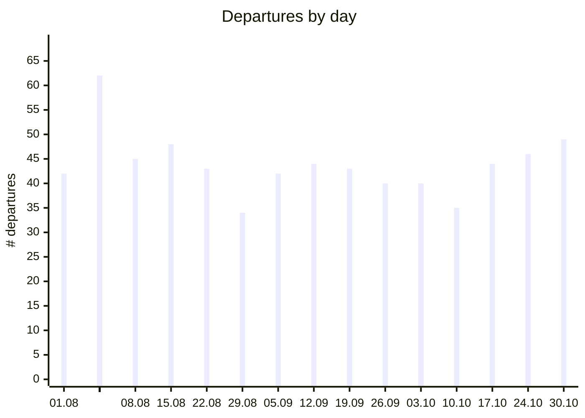

# tll-airport-departures

Tracking departures from Tallinn Airport. Data and graphs are updated daily.

## Passengers in the terminal

Hour-by-hour forecast. Quiet, steady, busy, or crowded. Each flight is spread across the two hours before departure, and holiday flights count for more.

**2026-10-31**

| Hour | Terminal | Why |
| --- | --- | --- |
| 04:00 | busy | 15 flights, 2 charters (Antalya, Tenerife (South)) |
| 05:00 | busy | 15 flights, 2 charters (Antalya, Tenerife (South)) |
| 06:00 | steady | 13 flights, 1 charter (Tenerife (South)) |
| 07:00 | steady | 9 flights |
| 08:00 | steady | 9 flights |
| 09:00 | steady | 7 flights |
| 10:00 | quiet | 8 flights |
| 11:00 | steady | 8 flights |
| 12:00 | busy | 12 flights, 1 charter (Antalya) |
| 13:00 | steady | 10 flights, 1 charter (Antalya) |
| 14:00 | steady | 9 flights, 1 charter (Antalya) |
| 15:00 | quiet | 9 flights |
| 16:00 | quiet | 6 flights |
| 17:00 | quiet | 5 flights |
| 18:00 | quiet | 5 flights |
| 19:00 | quiet | 6 flights |
| 20:00 | quiet | 5 flights |
| 21:00 | quiet | 2 flights |
| 22:00 | quiet | no flights |

## Trend of Daily Departures

Last 90 days. One bar per day.


```mermaid
---
xyChart:
    xAxis:
      labelFontSize: 8
---
xychart-beta
    title "Departures by day"
    x-axis ["01.08", " ", " ", " ", " ", " ", " ", "08.08", " ", " ", " ", " ", " ", " ", "15.08", " ", " ", " ", " ", " ", " ", "22.08", " ", " ", " ", " ", " ", " ", "29.08", " ", " ", " ", " ", " ", " ", "05.09", " ", " ", " ", " ", " ", " ", "12.09", " ", " ", " ", " ", " ", " ", "19.09", " ", " ", " ", " ", " ", " ", "26.09", " ", " ", " ", " ", " ", " ", "03.10", " ", " ", " ", " ", " ", " ", "10.10", " ", " ", " ", " ", " ", " ", "17.10", " ", " ", " ", " ", " ", " ", "24.10", " ", " ", " ", " ", "30.10"]
    y-axis "# departures" 0 --> 69
    bar [42, 56, 55, 44, 50, 51, 62, 45, 57, 58, 43, 53, 54, 61, 48, 57, 60, 46, 54, 55, 60, 43, 58, 58, 48, 54, 33, 32, 34, 52, 54, 45, 54, 49, 62, 42, 56, 57, 48, 53, 52, 61, 44, 54, 56, 47, 51, 52, 59, 43, 52, 55, 46, 51, 53, 57, 40, 48, 54, 42, 46, 52, 54, 40, 48, 50, 36, 45, 46, 53, 35, 49, 50, 34, 46, 52, 58, 44, 55, 56, 46, 48, 52, 57, 46, 50, 46, 51, 27, 49]
```

## Departures by quarter

Full history. Bars are the average departures per day. The line is the average number of destinations per day.


```mermaid
---
config:
  xyChart:
    showDataLabel: true
    xAxis:
      labelFontSize: 12
---
xychart-beta
    title "Departures by quarter"
    x-axis ["2024 Q3", "2024 Q4", "2025 Q1", "2025 Q2", "2025 Q3", "2025 Q4", "2026 Q1", "2026 Q2", "2026 Q3", "2026 Q4"]
    y-axis "per day" 0 --> 58
    bar [51.9, 43.6, 40.5, 49.4, 48.6, 46.7, 44.3, 50.0, 51.4, 47.4]
    line [26.6, 22.5, 21.3, 23.1, 23.1, 22.1, 20.9, 23.4, 24.5, 23.7]
```

## Unique destinations and departures

Departures to each city since 1 Aug 2024. Airports in the same city are counted together. A multi-stop flight is counted once for each city on the title. The rates are averages over that whole span, and a longer bar means more departures.

```
Helsingi                         6835   8.3/day   58.3/wk   253.7/mo  3044.5/yr  ████████████████████████
Stockholm                        3245   4.0/day   27.7/wk   120.5/mo  1445.4/yr  ███████████
Riia                             3115   3.8/day   26.6/wk   115.6/mo  1387.5/yr  ███████████
Varssavi                         2534   3.1/day   21.6/wk    94.1/mo  1128.7/yr  █████████
Frankfurt                        1943   2.4/day   16.6/wk    72.1/mo   865.5/yr  ███████
Kopenhaagen                      1673   2.0/day   14.3/wk    62.1/mo   745.2/yr  ██████
Amsterdam                        1332   1.6/day   11.4/wk    49.4/mo   593.3/yr  █████
Kardla                           1297   1.6/day   11.1/wk    48.1/mo   577.7/yr  █████
London                           1286   1.6/day   11.0/wk    47.7/mo   572.8/yr  █████
Kuressaare                       1271   1.6/day   10.8/wk    47.2/mo   566.1/yr  ████
Vilnius                          1156   1.4/day    9.9/wk    42.9/mo   514.9/yr  ████
Istanbul                          940   1.1/day    8.0/wk    34.9/mo   418.7/yr  ███
Antalya                           793   1.0/day    6.8/wk    29.4/mo   353.2/yr  ███
Berliin                           658   0.8/day    5.6/wk    24.4/mo   293.1/yr  ██
Munchen                           657   0.8/day    5.6/wk    24.4/mo   292.6/yr  ██
Oslo                              607   0.7/day    5.2/wk    22.5/mo   270.4/yr  ██
Pariis                            577   0.7/day    4.9/wk    21.4/mo   257.0/yr  ██
Zurich                            495   0.6/day    4.2/wk    18.4/mo   220.5/yr  ██
Brussel                           456   0.6/day    3.9/wk    16.9/mo   203.1/yr  ██
Milano                            385   0.5/day    3.3/wk    14.3/mo   171.5/yr  █
Barcelona                         380   0.5/day    3.2/wk    14.1/mo   169.3/yr  █
Malaga                            277   0.3/day    2.4/wk    10.3/mo   123.4/yr  █
Sharm El Sheikh                   265   0.3/day    2.3/wk     9.8/mo   118.0/yr  █
Heraklion                         246   0.3/day    2.1/wk     9.1/mo   109.6/yr  █
Dublin                            220   0.3/day    1.9/wk     8.2/mo    98.0/yr  █
Krakow                            205   0.2/day    1.8/wk     7.6/mo    91.3/yr  █
Viin                              194   0.2/day    1.7/wk     7.2/mo    86.4/yr  █
Hurghada                          179   0.2/day    1.5/wk     6.6/mo    79.7/yr  █
Budapest                          178   0.2/day    1.5/wk     6.6/mo    79.3/yr  █
Rooma                             171   0.2/day    1.5/wk     6.3/mo    76.2/yr  █
Praha                             155   0.2/day    1.3/wk     5.8/mo    69.0/yr  █
Nice                              152   0.2/day    1.3/wk     5.6/mo    67.7/yr  █
Tenerife                          132   0.2/day    1.1/wk     4.9/mo    58.8/yr  █
Gdansk                            125   0.2/day    1.1/wk     4.6/mo    55.7/yr  █
Tirana                            119   0.1/day    1.0/wk     4.4/mo    53.0/yr  █
Rhodos                            119   0.1/day    1.0/wk     4.4/mo    53.0/yr  █
Tivat                             115   0.1/day    1.0/wk     4.3/mo    51.2/yr  █
Billund                           114   0.1/day    1.0/wk     4.2/mo    50.8/yr  █
Burgas                            104   0.1/day    0.9/wk     3.9/mo    46.3/yr  █
Split                              98   0.1/day    0.8/wk     3.6/mo    43.7/yr  █
Veneetsia                          93   0.1/day    0.8/wk     3.5/mo    41.4/yr  █
Malta                              76   0.1/day    0.6/wk     2.8/mo    33.9/yr  █
Veneetsia-Treviso                  67   0.1/day    0.6/wk     2.5/mo    29.8/yr  █
Paphos                             66   0.1/day    0.6/wk     2.4/mo    29.4/yr  █
Palma De Mallorca                  65   0.1/day    0.6/wk     2.4/mo    29.0/yr  █
Gran Canaria                       60   0.1/day    0.5/wk     2.2/mo    26.7/yr  █
Dusseldorf                         52   0.1/day    0.4/wk     1.9/mo    23.2/yr  █
Hamburg                            47   0.1/day    0.4/wk     1.7/mo    20.9/yr  █
Tampere                            38   0.0/day    0.3/wk     1.4/mo    16.9/yr  █
Enfidha                            35   0.0/day    0.3/wk     1.3/mo    15.6/yr  █
Funchal                            35   0.0/day    0.3/wk     1.3/mo    15.6/yr  █
Salzburg                           27   0.0/day    0.2/wk     1.0/mo    12.0/yr  █
Genf                               26   0.0/day    0.2/wk     1.0/mo    11.6/yr  █
Dubrovnik                          21   0.0/day    0.2/wk     0.8/mo     9.4/yr  █
Kittila                            21   0.0/day    0.2/wk     0.8/mo     9.4/yr  █
Reykjavik                          20   0.0/day    0.2/wk     0.7/mo     8.9/yr  █
Bodrum                             16   0.0/day    0.1/wk     0.6/mo     7.1/yr  █
Larnaca                            16   0.0/day    0.1/wk     0.6/mo     7.1/yr  █
Ateena                             16   0.0/day    0.1/wk     0.6/mo     7.1/yr  █
Lamezia                            14   0.0/day    0.1/wk     0.5/mo     6.2/yr  █
Manchester                         11   0.0/day    0.1/wk     0.4/mo     4.9/yr  █
Madriid                            10   0.0/day    0.1/wk     0.4/mo     4.5/yr  █
Edinburgh                           8   0.0/day    0.1/wk     0.3/mo     3.6/yr  █
Birmingham                          8   0.0/day    0.1/wk     0.3/mo     3.6/yr  █
Catania                             5   0.0/day    0.0/wk     0.2/mo     2.2/yr  █
Faro                                5   0.0/day    0.0/wk     0.2/mo     2.2/yr  █
Kerkira                             4   0.0/day    0.0/wk     0.1/mo     1.8/yr  █
Visby                               4   0.0/day    0.0/wk     0.1/mo     1.8/yr  █
Goteborg                            3   0.0/day    0.0/wk     0.1/mo     1.3/yr  █
Cagliari                            2   0.0/day    0.0/wk     0.1/mo     0.9/yr  █
Leon                                2   0.0/day    0.0/wk     0.1/mo     0.9/yr  █
Tel Aviv                            2   0.0/day    0.0/wk     0.1/mo     0.9/yr  █
Bratislava                          2   0.0/day    0.0/wk     0.1/mo     0.9/yr  █
Istres Le Tube Istres Air Base      2   0.0/day    0.0/wk     0.1/mo     0.9/yr  █
Linz                                2   0.0/day    0.0/wk     0.1/mo     0.9/yr  █
Trieste                             2   0.0/day    0.0/wk     0.1/mo     0.9/yr  █
Tromso                              2   0.0/day    0.0/wk     0.1/mo     0.9/yr  █
Debrecen                            1   0.0/day    0.0/wk     0.0/mo     0.4/yr  █
Pisa                                1   0.0/day    0.0/wk     0.0/mo     0.4/yr  █
Hambantota                          1   0.0/day    0.0/wk     0.0/mo     0.4/yr  █
Bahrain                             1   0.0/day    0.0/wk     0.0/mo     0.4/yr  █
Pamplona                            1   0.0/day    0.0/wk     0.0/mo     0.4/yr  █
Szczecin-Goleniow Solidarnosc       1   0.0/day    0.0/wk     0.0/mo     0.4/yr  █
Luxembourg                          1   0.0/day    0.0/wk     0.0/mo     0.4/yr  █
Kosice                              1   0.0/day    0.0/wk     0.0/mo     0.4/yr  █
Liverpool                           1   0.0/day    0.0/wk     0.0/mo     0.4/yr  █
Bucharest                           1   0.0/day    0.0/wk     0.0/mo     0.4/yr  █
Farnborough                         1   0.0/day    0.0/wk     0.0/mo     0.4/yr  █
Malmo                               1   0.0/day    0.0/wk     0.0/mo     0.4/yr  █
RzeszowJasionka                     1   0.0/day    0.0/wk     0.0/mo     0.4/yr  █
Craiova                             1   0.0/day    0.0/wk     0.0/mo     0.4/yr  █
RAF Brize Norton                    1   0.0/day    0.0/wk     0.0/mo     0.4/yr  █
Kalamata                            1   0.0/day    0.0/wk     0.0/mo     0.4/yr  █
Bern                                1   0.0/day    0.0/wk     0.0/mo     0.4/yr  █
Akureyri                            1   0.0/day    0.0/wk     0.0/mo     0.4/yr  █
Katowice                            1   0.0/day    0.0/wk     0.0/mo     0.4/yr  █
Fort Worth                          1   0.0/day    0.0/wk     0.0/mo     0.4/yr  █
Brno                                1   0.0/day    0.0/wk     0.0/mo     0.4/yr  █
Tbilisi                             1   0.0/day    0.0/wk     0.0/mo     0.4/yr  █
Verona                              1   0.0/day    0.0/wk     0.0/mo     0.4/yr  █
Pardubice                           1   0.0/day    0.0/wk     0.0/mo     0.4/yr  █
La Rioja                            1   0.0/day    0.0/wk     0.0/mo     0.4/yr  █
Trondheim                           1   0.0/day    0.0/wk     0.0/mo     0.4/yr  █
```
