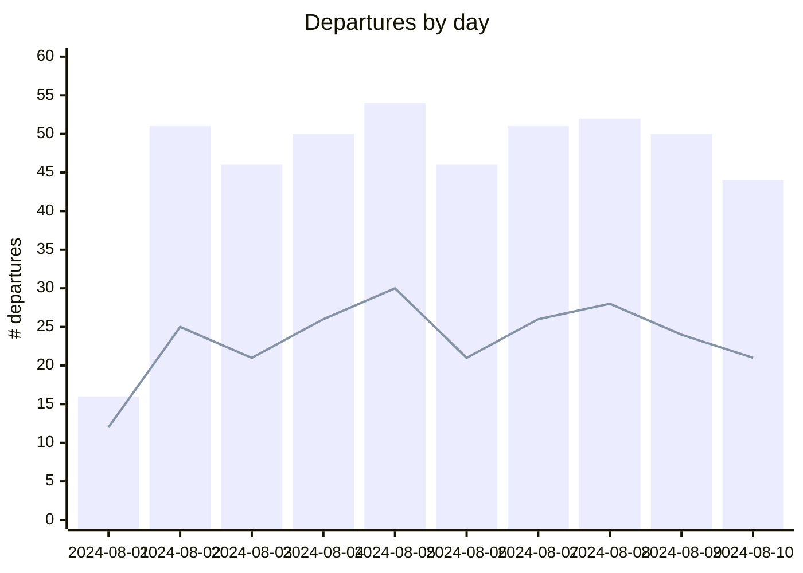
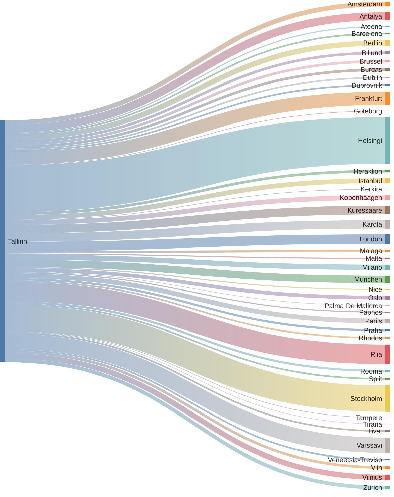

# tll-airport-departures

Tracking departures from Tallinn Airport. Data and graphs are updated daily.

## Trend of Daily Departures

Bars for total number of departures. Line for unique destinations.

## Unique destinations and departures

All destinations flown to from Tallinn. More departures = bigger node.
Note that umlauts don't seem to be supported in Mermaid Sankey Diagrams (experimental diagram).

